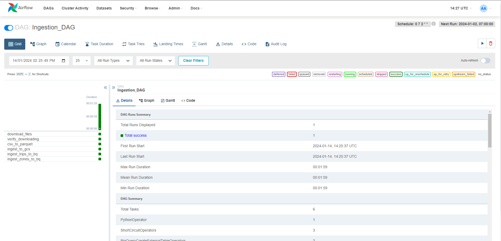

<!DOCTYPE html>
<html>
<body>
    <h1>Data Engineering Project #1</h1>
    <h4>Description</h4>
    
This is a personal project and is an introduction for me to data engineering concepts
    and tools.

    
In this project, we download public taxi records from <a href="https://www.nyc.gov/">
    nyc.gov</a> and load it into a data warehouse to be later transformed and visualised 
    through a clear dashboard.

    <h4>Tools</h4>
    <ul>
    <li>Google Cloud Platform</li>
    <li>Terraform</li>
    <li>Docker</li>
    <li>Airflow</li>
    <li>DBT</li>
    <li>BI Tool: to be decided</li>
    </ul>
    <h4>Prerequisites</h4>
    
In order to be able to run this program properly, you need to have the following:

        <ul>
        <li>Git bash installed on your machine. If not, visit this <a href="https://git-scm.com/download/win">link</a> 
        for more information on the download and installation.</li>
        <li>A Google Cloud Platform account. If not, you can create one and in the free trial you will have a 300$ 
        credit which will be more than enough for this project.</li>
        <li>Terraform installed on your machine. If not, visit this <a 
        href="https://developer.hashicorp.com/terraform/install?product_intent=terraform">
        link</a> for more information on the download and installation depending on your OS.</li>
        <li>Docker installed on your machine. If not, visit this <a
        href="https://www.docker.com/products/docker-desktop/">link</a> for more information on the download and 
        installation depending on your OS.</li>
        </ul>
    <h4>Steps to run</h4>
    
Below are the steps to follow in order to create the BI dashboard displayed below.

    <ol type="1">
    <li>Clone the 'de_pipeline' repository locally.</li>
    <li>Creating a service account in GCP</li>
        <ol>
        <li><b>Optional - </b>Create a new project.</li>
        <li>From the Google console, make sure to be working on the desired project. From the navigation menu, go
        to 'IAM & Services' > 'Service Account'. Create a new service account and assign it owner role.</li>
        <li>Once created, click on the three vertical points for the new service account and go to 'Manage keys'.
        Click 'Add key' and 'Create new key'. Pick the JSON format and a file should be downloaded on your local
        machine. Copy this file in 'path_to_repo/de_pipeline/credentials/' and rename it to 'gc-creds.json'.</li>
        </ol>
    <li>Provisioning resources</li>
        <ol>
        <li>Open 'terraform/variables.tf' using a text editor to update the Google resources which we are going
        to provision.</li>
        <li><b>Mandatory - </b>Variable 'project': update the default value to your project id from GCP.</li>
        <li><b>Optional - </b>You can tweak the other parameters depending on your preferences.</li>
        <li>Open a git bash terminal. Make sure to be in: 'path_to_repo/de_pipeline/terraform' and run the below
        commands:</li>
        <li>'terraform init'</li>
        <li>'terraform plan'</li>
        <li>'terraform apply' - Make sure to type yes when prompted to confirm the resources to be created.</li>
        <li>Once done, you can check manually from the Google console that a BigQuery dataset and a bucket
        have been created.</li>
        </ol>
    <li>Triggering Airflow dag to ingest data from nyc.gov to BigQuery.</li>
        <ol>
        <li>Open 'path_to_repo/de_pipeline/Dockerfile' and update GC_PROJECT_ID, GC_DATASET_NAME and GCS_BUCKET_NAME
        environment variables and make sure they are consistent with provided names in the terraform variables file.
        </li>
        <li>Make sure docker engine is running. Open a git bash terminal and execute 'docker ps' command to make
        suer that the engine is running.</li>
        <li>Open a git bash terminal and make sure you are in the project directory. Execute the following command: 
        'sh run.sh' - It may take some time depending on your internet connection.</li>
        <li>Wait until you see the following line in the terminal ''</li>
        <li>Open your browser and go to <a href="http://localhost:8080/login/">localhost</a> where Airflow webserver 
        is running.</li>
        <li>Login in using 'airflow' for the username and password. You should be prompted to the home screen.</li>
        <li>Trigger the 'IngestionDAG' dag and while it is running, you can explore it and check the status
        of each task in real time.</li>
        <li>This should be the grid for the run dag : 
        </li>
        <li>Once done, you can check manually from the Google console that a 'parquet' folder have been created and
        two parquets files have been uploaded to it. Also, make sure that two tables have been created under the
        BigQuery dataset.</li>
        <li>Once verified, you can get back to the terminal running 'run.sh' and pres 'CTRL+C' two times to kill
        the running processes. Also, run the following command to clean up the created resources: 
        'docker compose down --volumes --rmi all'</li>
        </ol>
    <li>Transforming BigQuery table</li>
    <li>Creating the dashboard</li>
    </ol>
    <h4>Improvements</h4>
    
Although this was an introduction to Data Engineering, I should have focused more on the following:

    <ul>
    <li>The service account granted permissions. The assigned ones are more than what we needed and ideally, in a 
    production environment, we should limit these permissions as much as we could.</li>
    </ul>
</body>
</html>